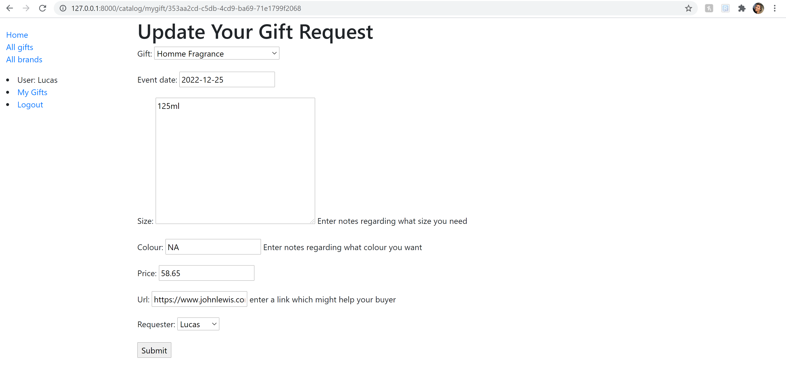

# Introduction

The aim of this project is to create a website to assist my family in creating gift lists for Christmas, birthdays and other occasions. Each family member can create their own list, providing specific details of the gift they would like. 
Each family can also view the lists of others, and can choose a gift to buy that person. Other buyers will know that that gift has been taken by someone else, and will have to select another. Receivers will not be able too see
which gifts they will receive. 

## Technologies

Python 3.9, Django==3.2.3, coverage==5.5, Black

## Getting Started

Please follow the instructions below to run this application. 

``sh
## (Optional) Create and use a virtual environment:
## https://packaging.python.org/guides/installing-using-pip-and-virtual-environments/#creating-a-virtual-environment
python -m venv env
source env/bin/activate

## Install Django and my other dependencies:
## https://pip.pypa.io/en/stable/user_guide/#requirements-files
pip install -r requirements.txt

## Run my tests(all should pass):
python manage.py test

## Optional: run Coverage (using batch file) to receive a test coverage report in stdout
cvrg.bat

## Build the database:
python manage.py migrate

## Start the Django development server:
## https://docs.djangoproject.com/en/3.2/ref/django-admin/#django-admin-runserver
python manage.py runserver
```

After these commands, you should be able to test my app manually at http://localhost:8000/.

You will need to create a super user to access the Django admin site and to 
login (https://docs.djangoproject.com/en/3.2/ref/contrib/admin/): to do this, 
run `python manage.py createsuperuser` and follow the instructions.

## Project Status

Still being developed. 
###### To do:

- Add a list of all users, including links to view their gift lists. 

- Add functionality to enable users to select and tag the gift(s) they will buy for another user

- Add full Django authorisation functionality, so that users can create their own accounts

- Add Secret Santa functionality, including e-mails to notify users who they will be buying for. 

